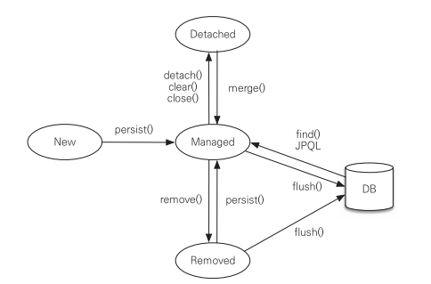

### Q) JPA에서 Entity의 Life Cycle은 어떻게 이루어지나요?

#### A) 처음 엔티티 객체를 생성했을 때는 영속성 컨텍스트와는 관련이 없는 비영속 상태에서 영속성 컨텍스트에 저장을 하게되면서 영속 상태가 되면 DB에 객체를 저장할 수 있습니다. 영속 상태인 엔티티를 detach() 혹은 remove() 메소드를 사용해 각각 준영속, 삭제 상태로 변환이 가능한 Life Cycle을 가지고 있습니다.

추가 설명)
엔티티 객체를 생성하게 되면 영속성 컨텍스트와는 관련이 없는 비영속 상태이고 persist() 메소드를 통해 객체를 영속성 컨텍스트에 올리게 되면 객체는 영속성 컨텍스트에서 관리하는 영속 상태가 된다. detach() 메소드를 사용하면 영속성 컨텍스트에 저장되었다가 분리된 상태가 되며 remove() 메소드를 사용하면 삭제 상태가 된다.
DB에서 find() 메소드를 이용해 찾은 엔티티는 영속성 컨텍스트에서 관리하는 영속 상태를 가진 상태이다.

**아래 그림 참고**

